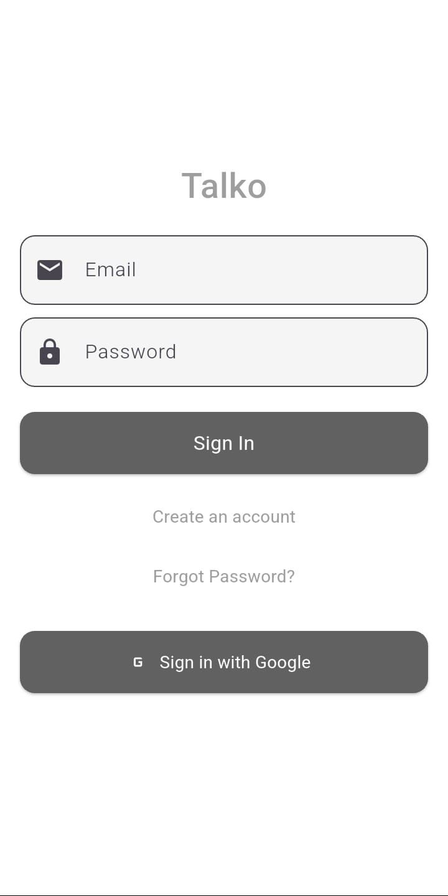
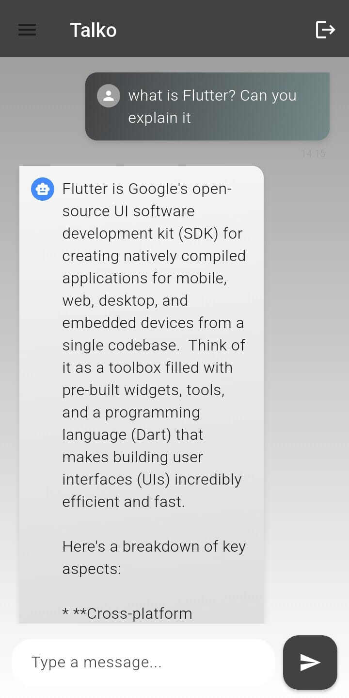
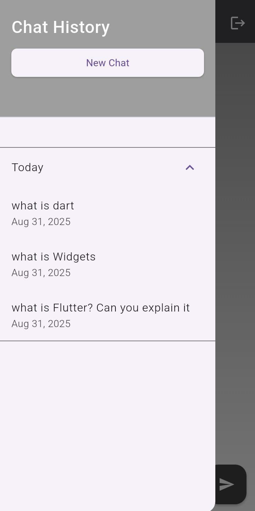

#  Talko — Your AI Chat Companion

**Talko** is a Flutter-based AI chatbot app that delivers a WhatsApp-like chat experience.  
Built with Firebase, Gemini API, and Riverpod, Talko allows users to authenticate, engage in real-time conversations with an AI, and view their chat history seamlessly.

---

##  Features

###  Authentication
- Sign up or log in using email/password or Google (via Firebase Auth).
- Secure user-specific chat experience with fast access to previous chats.

###  Messaging Experience
- Conversations are stored in Firestore (with `conversations` collection and `messages` subcollection).
- Messages are displayed in chronological order with correct user-bot flow.
- Real-time syncing of messages via Riverpod’s `StreamProvider`.
- WhatsApp-style UI with smoothly scrolling chat and left-right message alignment.

###  Adaptive AI Replies
- Powered by the Gemini API with streaming responses to mimic real-time typing.
- Lightweight loading animations and typing effects enhance realism.

###  Conversations Sidebar
- View grouped chat history by date (Today, Yesterday, Older), sorted using a Firestore composite index.
- Easily resume old chats or start a new conversation.

---

##  Tech Stack

| Technology             | Purpose                              |
|------------------------|--------------------------------------|
| **Flutter**            | Cross-platform app development       |
| **Firebase Auth**      | Email & Google login functionality   |
| **Cloud Firestore**    | Real-time chat storage               |
| **Riverpod**           | Reactive state management            |
| **Gemini API**         | AI-generated chat responses          |
| **UUID & Timestamps**  | Ordered chat flow and data integrity |

---

##  Project Structure (Simplified)

lib/
├── models/ # Conversation, Message, User models
├── services/ # Firebase auth, Firestore, Gemini logic
├── providers/ # Riverpod providers for auth, chat, conversations
├── screens/ # LoginScreen, ChatScreen
├── widgets/ # Reusable UI components (MessageBubble, Sidebar)
└── main.dart # App entry point
---

##  Screenshots

###  Login Screen  

###  Chat Screen  

###  Conversation History  

---

##  Challenges & Lessons Learned

1. **Indexing Firestore Queries**  
   – Added a composite index `(userId, createdAt)` for fast sidebar loading.

2. **Chronological Message Order**  
   – Fixed UI glitches by adjusting message queueing and timestamp handling.

3. **Gemini API Integration**  
   – Implemented streaming with error handling for seamless bot responses.

4. **Real-time UI with Riverpod**  
   – Used `StreamProvider` and `ConsumerWidget` for dynamic chat updates.

5. **Google Sign-In Configuration**  
   – Solved ApiException errors by updating Firebase SHA-256 and client ID settings.

---

##  Author

Developed by **Harihareswaran**, creator of Talko — an intuitive AI chat app built with innovation and care.

---
